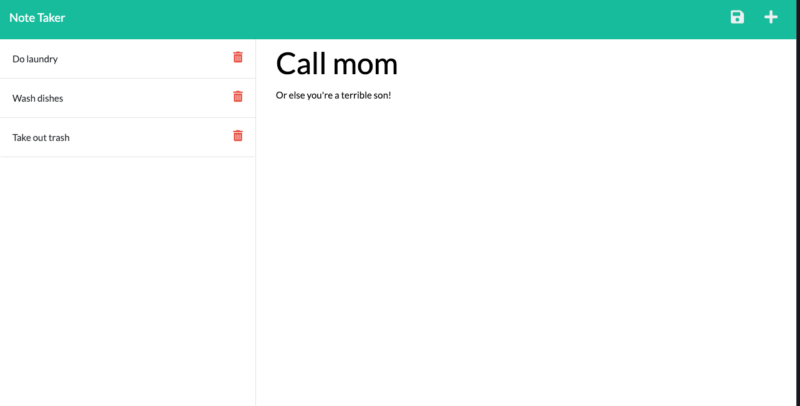

# Note Taker 

    
## Table of contents

* [Description](#description)

* [Launched Application](#launched-application)

* [What I Learned](#what-i-learned)

* [Usage](#usage)

* [License](#license)

* [Questions](#questions)
    

## Description
This project allows users to write, save, and delete notes. Notes contain a 'note title' and 'note text', which allows for a simple and effective user interface.

## Launched Application
https://blooming-hollows-55892.herokuapp.com/  

## What I Learned
* Learned how to set up an Express.js server * Established GET, POST, and DELETE routes using Express.js * Learned more about implementing fetch() functionality * Gained experiencing implementing new functionality into an existing code base * Further honed my understanding of Object Oriented Programming 

    

## Usage
This app is intended to increase pro

## License
MIT

(https://opensource.org/licenses/MIT)

&copy; 2021
  
Permission to use, copy, modify, and/or distribute this software for any purpose with or without fee is hereby granted, provided that the above copyright notice and this permission notice appear in all copies.

THE SOFTWARE IS PROVIDED "AS IS" AND THE AUTHOR DISCLAIMS ALL WARRANTIES WITH REGARD TO THIS SOFTWARE INCLUDING ALL IMPLIED WARRANTIES OF MERCHANTABILITY AND FITNESS. IN NO EVENT SHALL THE AUTHOR BE LIABLE FOR ANY SPECIAL, DIRECT, INDIRECT, OR CONSEQUENTIAL DAMAGES OR ANY DAMAGES WHATSOEVER RESULTING FROM LOSS OF USE, DATA OR PROFITS, WHETHER IN AN ACTION OF CONTRACT, NEGLIGENCE OR OTHER TORTIOUS ACTION, ARISING OUT OF OR IN CONNECTION WITH THE USE OR PERFORMANCE OF THIS SOFTWARE.   
        

## Questions  
* Github: [www.github.com/cooperflynn](www.github.com/cooperflynn)
* Email: cooperflynn91@gmail.com
